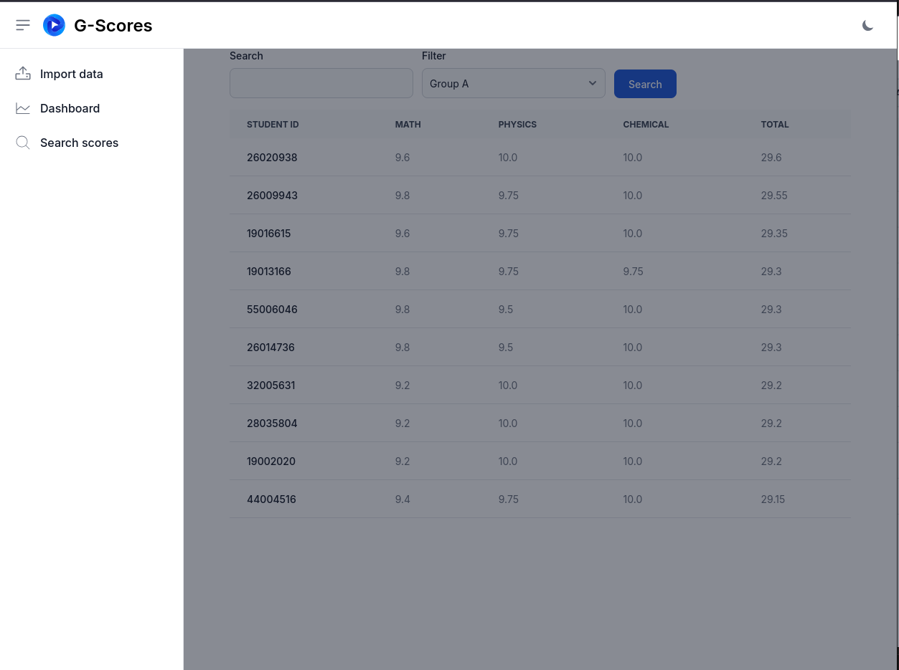

# GUIDELINE
## Features of web
* Import data file (csv file), if file have vase size, upload processing will take a lot of time (this case is about 6 minutes)


* Themes: Dark/Light mode 

| Dark | Light |
| ------- | ------- |
|  | |

* Statistics of the number of students with scores in the above 4 levels by subjects.


* Check score from registration number


* Filter 10 students having highest score in Group A (math, physics, chemical) 


* Responsive design (desktops, tablets & mobile phones)


| Phone | Tablet | Desktop |
| ------- | ------- | ------- |
|  |  |  |

## Set up environment & deployement project

* Step 1: clone this repository in Github
``` bash
git clone https://github.com/Khoi1308/student_management.git
```
Then 
``` bash
cd student_management
```
* Step 2: Back up & restore database by DBeaver

  - host: localhost

  - post: 5432

  - database scores_management_development

* Step 3: Set up enviroment
Firt, you have installed Docker and Docker compose (link: https://docs.docker.com/engine/install)
Then, create container from Dockerfile
```bash
docker build -t rails_app . 
```
Then, add vite by yarn
``` bash
yarn add vite
```
Finally, deployment project by terminal
```bash
bin/dev
```
